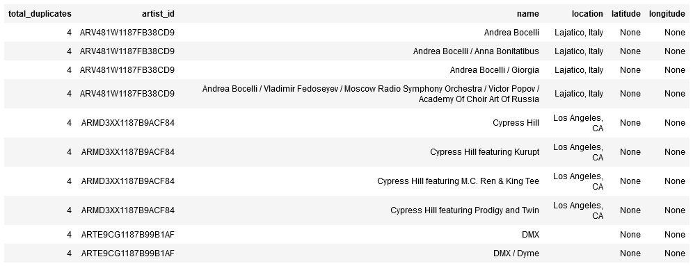
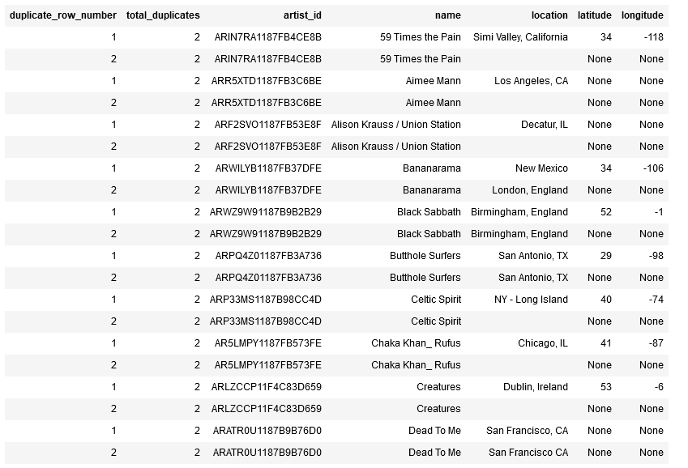

# Data Warehouse for Sparkify: ETL from S3 to Redshift

## 1. Goals of the Project

Sparkify, a music streaming service, wants to analyze the data they've been collecting on songs and user activity in their music streaming app. Currently, the data is saved as JSON logs on user activity and on the songs in their apps.  

The goals are:

* Design a Redshift Data Warehouse that enables the analytics team to easily query their data.
* Create an ETL-process that loads log and songs data into that database.
* Check for duplicates in the star schema

## 2. Files and data format

The creation of the database and the definition of the ETL-process relies on four files:

* `dwh.cfg` defines and stores the specifications for the source files on AWS S3 and the Data Warehouse on AWS Redshift.
* `sql_queries.py` defines the tables for the database and the process of copying and inserting data.
* `create_tables.py` uses those queries to set up the database and its tables.
* `etl.py` converts data from the JSON source files into the staging tables, inserts them into the star schema, and removes any duplicate records.

The data is stored in two folders, `data/log_data` and `data/song_data` on an AWS S3-machine specified in `dwh.cfg`.

## 3. Database schema

For the ETL-process, we are going to use **two staging tables** in which we copy our data. `staging_events` and `staging_songs`. These tables consist of the same columns as the original dataset and are only used to make transformation easier.

For the Data Warehouse, the **tables are organized in a Star Schema** that consists of one fact table and four dimension tables:

* `songplays` (FACT table) with columns
  *  
  `start_time`
  *  
  `user_id`
  *  
  `level`
  *  
  `song_id`
  *  
  `artist_id`
  *
  `session_id`
  *
  `location`
  *
  `user_agent`
* `users` (DIMENSION table) with columns
  * 
  `user_id`
  *
  `first_name`
  *
  `last_name`
  *
  `gender`
  *
  `level`
* `songs` (DIMENSION table) with columns
  *
  `song_id`
  * 
  `title`
  *
  `artist_id`
  *
  `year`
  *
  `duration`
* `artists` (DIMENSION table) with columns
  * 
  `artist_id`
  *
  `name`
  *
  `location`
  *
  `latitude`
  *
  `longitude`
* `time` (DIMENSION table) with columns
  * 
  `start_time`
  *
  `hour`
  *
  `day`
  *
  `week`
  *
  `month`
  *
  `year`
  *
  `weekday`

## 4. Explanation of the Data Warehouse setup

The creation of the Redshift cluster and the definition of its schema is defined and executed in `create_tables.py`:

1. The `main` function reads the specifications for the configurations and establishes a connection to the Data Warehouse.
2. The `create_cluster` function creates a new IAM-role on AWS to access the S3-storage and then creates a cluster due to the specifications in the config-file. The function will proceed until the cluster is available, and finally writes both the ARN of the created role and the endpoint of the cluster into the config-file.
3. The `drop_tables` function checks for existing tables in Redshift and, if found, drops the ones to use for the ETL-process.
4. Finally, the `create_tables` function creates both the staging tables and the tables defined in the star schema.

## 5. Explanation of the ETL-process

The process of extracting, transforming and loading data works through the functions defined in `etl.py`:

1. The `main` function reads the specifications for the configurations and establishes a connection to the Data Warehouse.
2. The `load_staging_tables` function copies all files from the specified S3-storage into the staging tables.
3. The `insert_tables` function inserts this data into the tables of the Star Schema.
4. The `check_for_duplicates` function checks each table in the Star Schema for duplicates and starts a removing process.
  *  
  Actually, there is only one query prepared to remove duplicates: for `artists` table. The table contains several records with the same `artist_id`; however, on a closer look, some of them are not actually duplicates, since the artist name is often a collection of several artists.  
  
  When filtering for the comination of both `artist_id` and `name`, here are some records which we could call real duplicates:
  
  By sorting those records along location, latitude, and longitude, we can better identify the most complete records (with duplicate_row_number=1). Only these records are kept, the duplicates are deleted.
5. Finally, the `drop_staging_tables` function asks the user if they want to drop the staging_tables, since they are not needed any more.

## 6. How to set up the Data Warehouse

To set up a Redshift cluster on AWS, you have to store your AWS access key and your AWS secret key in the config-file, `dwh.cfg`, first.

If this is done, open a console, navigate to the folder of your files and type `python create_tables.py`. If this runs without errors, you have created a Redshift cluster on AWS and the tables necessary for the ETL-process.

## 6. How to load data into the Data Warehouse

To start the ETL-process, navigate to the folder of your files and type `python etl.py`. If the script runs without errors, your data has been copied, transformed and cleaned and stored in your Data Warehouse.

## 7. How to delete the cluster and the ARN role

To eventually delete both the cluster and the role, type `python delete_cluster_and_role` and confirm both prompts in the terminal. 
